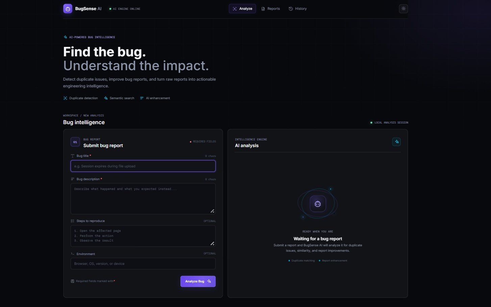
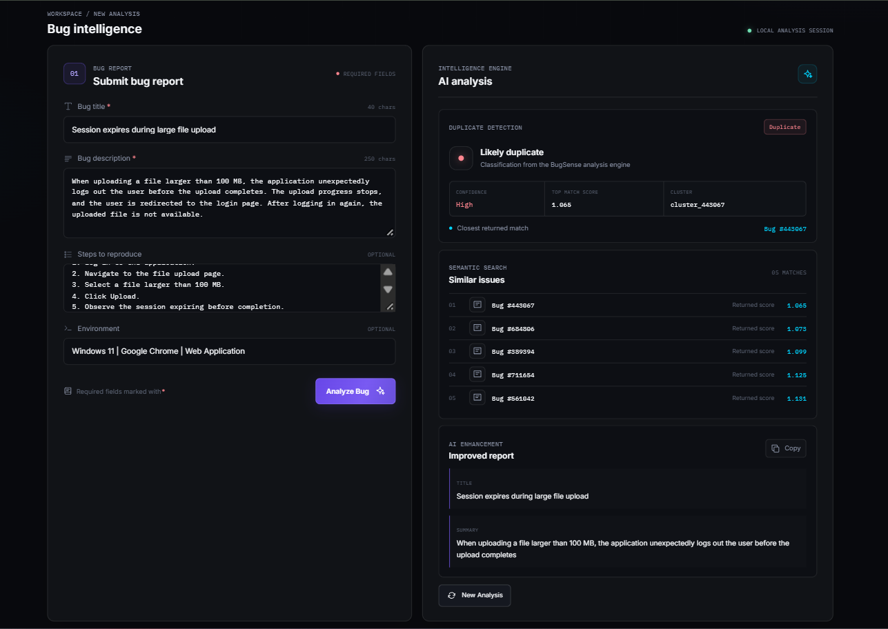
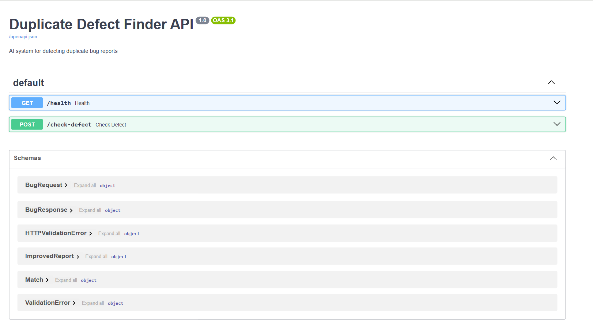
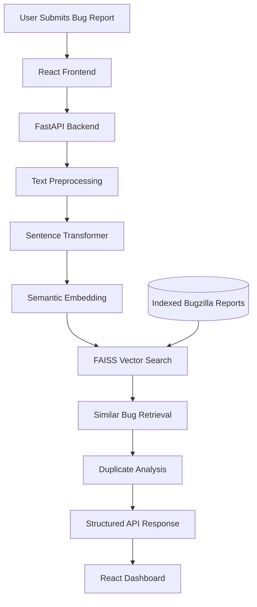

<div align="center">

# 🪲 BugSense AI

### Understand the Bug. Find the Match. Stop the Duplicate.

**An AI-powered duplicate defect detection system using Natural Language Processing, semantic embeddings and vector similarity search.**


<br>

**Different Words. Same Bug. One Intelligent Search.**

[Overview](#-overview) •
[Features](#-key-features) •
[Preview](#-application-preview) •
[Architecture](#-system-architecture) •
[Installation](#-getting-started) •
[API](#-api-documentation) •
[Roadmap](#-development-roadmap)

</div>

---

## 📌 Overview

**BugSense AI** is an AI-powered duplicate defect detection system designed to help software developers and QA teams identify potentially duplicate bug reports.

Large software projects often receive multiple reports describing the same underlying problem using different terminology.

Traditional keyword-based search may fail to identify these reports because it relies heavily on matching words.

BugSense AI addresses this challenge using **Sentence Transformers and FAISS vector similarity search**.

The system converts bug descriptions into semantic embeddings, retrieves potentially related historical defects and presents the results through an interactive web interface.

It also provides duplicate classification, cluster identifiers and structured bug report enhancement.

The objective is to support efficient defect triaging, reduce repetitive investigations and improve bug reporting quality.

---

## 🎯 The Problem

Consider two bug reports.

**Bug Report #101**

> The application crashes whenever a user uploads a large image.

**Bug Report #245**

> Uploading high-resolution photographs causes the software to close unexpectedly.

Although the descriptions use different words, they may describe the same underlying defect.

A keyword-based search might overlook their relationship.

BugSense AI uses semantic embeddings to retrieve potentially related reports even when their wording differs.

### Project Objectives

- Understand the semantic meaning of bug descriptions.
- Identify potentially duplicate defect reports.
- Retrieve similar historical defects.
- Provide duplicate classification.
- Display related bug clusters.
- Improve the structure and readability of bug reports.
- Support developers and QA teams during defect triaging.

---

## ✨ Key Features

### 🧠 Semantic Bug Understanding

Uses Sentence Transformers to convert bug titles and descriptions into numerical embeddings.

These embeddings represent the semantic meaning of the submitted text.

### ⚡ FAISS Vector Search

Uses FAISS to retrieve similar bug reports from an indexed dataset.

### 🔍 Duplicate Detection

Analyzes the submitted report and displays a duplicate classification with a confidence label.

Duplicate classifications are model-generated assessments and should be verified before reports are merged.

### 📊 Similar Bug Retrieval

Displays the five closest retrieved historical defect reports with their identifiers and returned scores.

### 🧩 Cluster Identification

Displays a cluster identifier associated with the analysis result.

### ✍️ Bug Report Enhancement

Generates a structured version of the submitted report, including an improved title and summary.

### 🌐 React Dashboard

Provides an interactive interface for submitting bug reports and viewing AI-generated results.

### 🔗 FastAPI Backend

Connects the frontend to the AI analysis pipeline through a Python-based REST API.

---

## 🖥️ Application Preview

### 1. BugSense AI Dashboard

The main dashboard provides a structured interface for submitting bug reports.

Users can enter a bug title, description, reproduction steps and environment details.



### 2. AI-Powered Duplicate Detection

The analysis interface displays duplicate classification, confidence, retrieved bug reports, cluster information and an improved report.



### 3. FastAPI Backend Documentation

BugSense AI provides interactive API documentation through Swagger UI.



---

## 🏗️ System Architecture



### How It Works

**1. Bug Report Submission**

The user submits a bug title and description through the React frontend.

Optional information includes reproduction steps and environment details.

**2. Text Preprocessing**

The backend prepares the submitted text for semantic analysis.

**3. Embedding Generation**

The Sentence Transformer model converts the bug description into a numerical vector.

**4. Vector Similarity Search**

FAISS retrieves the nearest defect embeddings from the indexed dataset.

**5. Duplicate Analysis**

The system processes the retrieved candidates and returns its duplicate classification.

**6. Report Enhancement**

The application generates a structured version of the submitted bug report.

**7. Results**

The frontend displays the analysis results, similar defects and improved report.

> Semantic similarity indicates that reports may be related. It does not independently prove that they describe the same underlying defect.

---

## 🛠️ Technology Stack

| Layer | Technology |
|---|---|
| Frontend | React, Vite |
| Backend | Python, FastAPI |
| API Server | Uvicorn |
| NLP | Sentence Transformers |
| Embedding Model | all-MiniLM-L6-v2 |
| Vector Search | FAISS |
| Dataset | Bugzilla Defect Reports |
| Data Processing | Python, Pandas, NumPy |
| Development | VS Code, Git, GitHub |

---

## 📂 Project Structure

```text
BugSense-AI/
│
├── ai/
│
├── api-backend/
│   └── api/
│
├── services/
│
├── clustering/
│
├── enhancer/
│
├── frontend/
│
├── assets/
│   ├── dashboard.png
│   ├── duplicate-results.png
│   └── api-docs.png
│
├── data/
│   ├── raw/
│   └── processed/
│
├── models/
│   └── vector_index/
│
├── scripts/
│   └── build_index.py
│
├── tests/
│
├── config.py
├── run_server.py
└── README.md
```

Some directories may be reserved for further development.

---

## 🧠 The Intelligence Behind BugSense AI

### Semantic Embedding Model

BugSense AI uses the pretrained Sentence Transformer model:

```text
sentence-transformers/all-MiniLM-L6-v2
```

The model converts bug descriptions into 384-dimensional numerical embeddings.

For example:

**Report A**

```text
Application crashes when uploading a large image.
```

**Report B**

```text
Uploading high-resolution photos causes the
application to close unexpectedly.
```

Although the wording differs, the descriptions express potentially related problems.

Semantic embeddings help retrieve reports based on contextual meaning rather than exact keyword matches.

### FAISS-Powered Retrieval

FAISS (Facebook AI Similarity Search) enables efficient nearest-neighbor search across indexed defect embeddings.

The indexing pipeline:

1. Loads the processed defect dataset.
2. Combines bug titles and descriptions.
3. Generates semantic embeddings.
4. Stores the embeddings in a FAISS index.
5. Preserves defect identifiers as metadata.

The indexing approach uses:

```python
faiss.IndexFlatL2
```

This index performs exact nearest-neighbor search using squared Euclidean distance.

For L2 distance, lower scores indicate closer vectors.

These distances should not be interpreted directly as similarity percentages.

---

## 🚀 Getting Started

Follow these instructions to run BugSense AI locally.

### Prerequisites

- Python
- Node.js and npm
- Git
- VS Code or another code editor

### 1. Clone the Repository

```bash
git clone https://github.com/JibinMathewB/BugSense-AI.git
cd BugSense-AI
```

### 2. Create a Python Virtual Environment

**Windows**

```powershell
python -m venv .venv
.\.venv\Scripts\Activate.ps1
```

**Linux**

```bash
python3 -m venv .venv
source .venv/bin/activate
```

### 3. Install Backend Dependencies

If the project contains a root-level `requirements.txt` file, run:

```bash
pip install -r requirements.txt
```

The main Python dependencies include:

```text
fastapi
uvicorn
sentence-transformers
faiss-cpu
pandas
numpy
```

### 4. Prepare the Dataset

Ensure that the processed Bugzilla dataset is available at:

```text
data/processed/cleaned_bug_reports.csv
```

### 5. Build the FAISS Index

Run:

```bash
python scripts/build_index.py
```

The indexing script generates the vector index and associated metadata.

Expected output:

```text
models/vector_index/
├── faiss_index.bin
└── metadata.pkl
```

### 6. Start the Backend

Run:

```bash
python run_server.py
```

The backend runs locally at:

```text
http://localhost:8000
```

Interactive API documentation:

```text
http://localhost:8000/docs
```

### 7. Start the Frontend

Open a new terminal.

Navigate to the frontend directory:

```bash
cd frontend
```

Install dependencies:

```bash
npm install
```

Start the development server:

```bash
npm run dev
```

Open the local URL displayed by Vite.

The default Vite development address is:

```text
http://localhost:5173
```

---

## 📡 API Documentation

BugSense AI provides a REST API built using FastAPI.

Interactive Swagger documentation is available at:

```text
http://localhost:8000/docs
```

### GET `/health`

Health-check endpoint for verifying backend availability.

### POST `/check-defect`

Analyzes a submitted bug report.

The API accepts bug information and returns structured analysis results.

### Example Request

```json
{
  "title": "Session expires during large file upload",
  "description": "When uploading a file larger than 100 MB, the application unexpectedly logs out the user before the upload completes.",
  "steps": "Log in, navigate to the upload page, select a large file and click Upload.",
  "environment": "Windows 11 | Google Chrome"
}
```

The exact request schema and response fields can be inspected through Swagger UI.

---

## 🧪 Example Analysis

The following synthetic test report was submitted through the application.

### Submitted Bug

**Title**

```text
Session expires during large file upload
```

**Description**

```text
When uploading a file larger than 100 MB, the
application unexpectedly logs out the user
before the upload completes.

The upload progress stops, and the user is
redirected to the login page.
```

**Environment**

```text
Windows 11 | Google Chrome | Web Application
```

### Observed Application Output

The application displayed:

| Field | Result |
|---|---|
| Classification | Likely duplicate |
| Confidence label | High |
| Retrieved matches | 5 |
| Cluster identifier | cluster_443067 |
| Closest returned bug | 443067 |

These are observed outputs from a demonstration, not independently verified duplicate-detection accuracy measurements.

---

## 📊 Evaluation

The next development milestone is to evaluate duplicate retrieval quality using a labeled dataset.

Planned evaluation metrics include:

| Metric | Purpose |
|---|---|
| Precision@K | Relevance of the top K results |
| Recall@K | Proportion of known duplicates retrieved |
| Mean Reciprocal Rank | Ranking of the first relevant result |
| Search Latency | Retrieval response time |

A labeled evaluation dataset is necessary to determine whether the retrieved reports are genuine duplicates.

Benchmark results will be published after evaluation is completed.

---

## 🗺️ Development Roadmap

### Phase 1 — Core AI Development

- [x] Bugzilla dataset preprocessing
- [x] Sentence Transformer integration
- [x] Semantic embedding generation
- [x] FAISS vector indexing
- [x] FastAPI backend setup

### Phase 2 — Full-Stack Development

- [x] React frontend
- [x] Bug report submission interface
- [x] Frontend and backend demonstration
- [x] Similar defect retrieval interface
- [x] Duplicate classification display
- [x] Structured report enhancement display
- [ ] Improved error handling
- [ ] Comprehensive integration testing

### Phase 3 — Advanced AI

- [ ] Duplicate detection benchmarking
- [ ] Cluster quality evaluation
- [ ] Report enhancement quality evaluation
- [ ] Visual analytics dashboard

### Phase 4 — Deployment

- [ ] Automated testing
- [ ] Production deployment
- [ ] Public demonstration

---

## 🔮 Future Scope

### Intelligent Defect Clustering

Improve the identification and organization of related defect families.

### AI-Assisted Report Enhancement

Extend report enhancement to produce clearer reproduction steps, expected results and actual results without inventing missing information.

### Defect Analytics

Visualize recurring bugs and analyze patterns across software projects.

### Issue Tracker Integration

Potential integrations include:

- Jira
- GitHub Issues
- Bugzilla

### Production Deployment

Deploy the application to make duplicate detection accessible through a hosted web interface.

---

## 🎓 Learning Outcomes

BugSense AI demonstrates the practical application of:

- Natural Language Processing
- Semantic Embeddings
- Vector Similarity Search
- REST API Development
- Full-Stack Web Development
- AI Model Integration
- Software Defect Management

The project explores how pretrained language models and vector search can support real-world software quality assurance workflows.

---

## 👨‍💻 Developer

**Jibin B Mathew**

B.E. Robotics and Automation

Interested in Robotics, Artificial Intelligence, ROS 2 and Software Development.

[](https://github.com/JibinMathewB)

[](https://www.linkedin.com/in/jibinmathew5/)

---

<div align="center">

### 🪲 BugSense AI

**Because the same bug shouldn't need to be discovered twice.**

Built with Python, React, FastAPI, Sentence Transformers and FAISS.

</div>